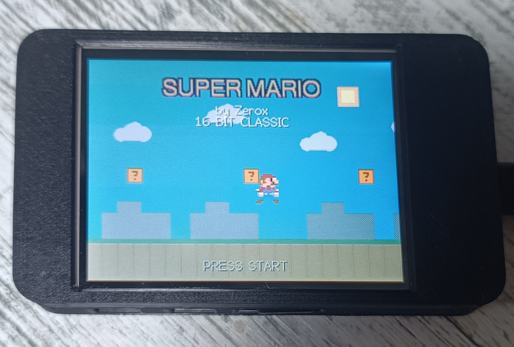
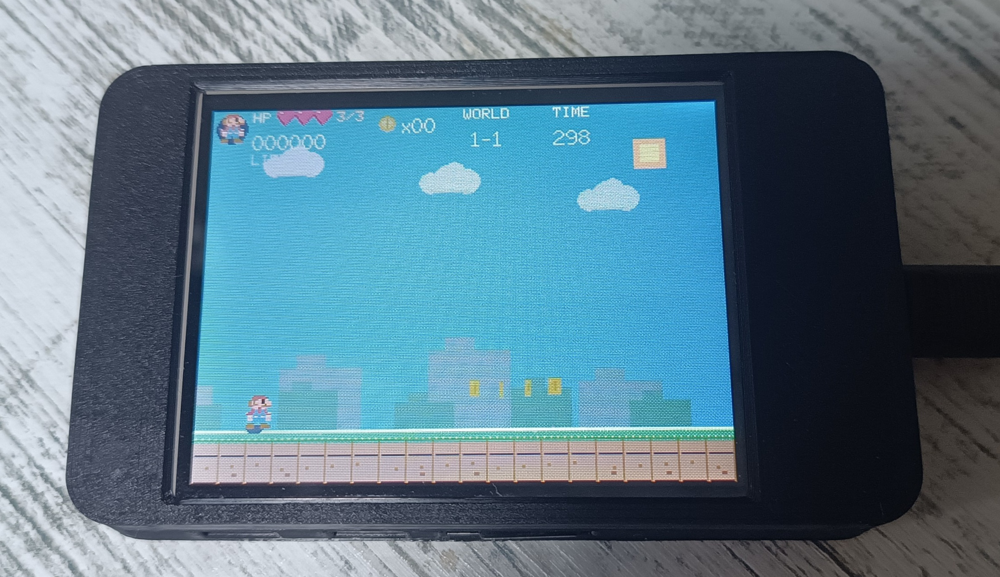
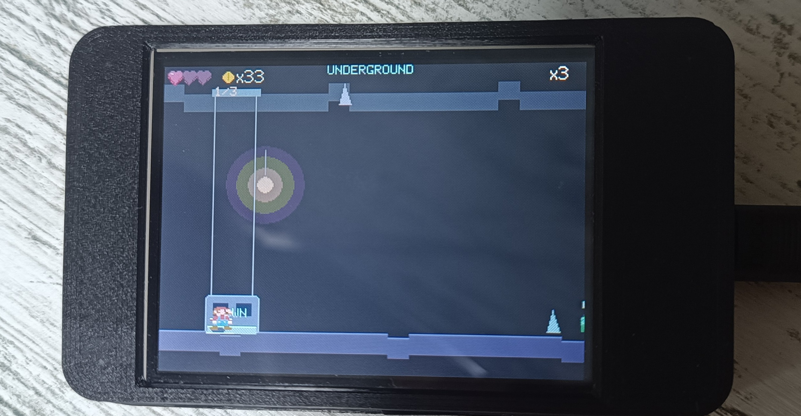
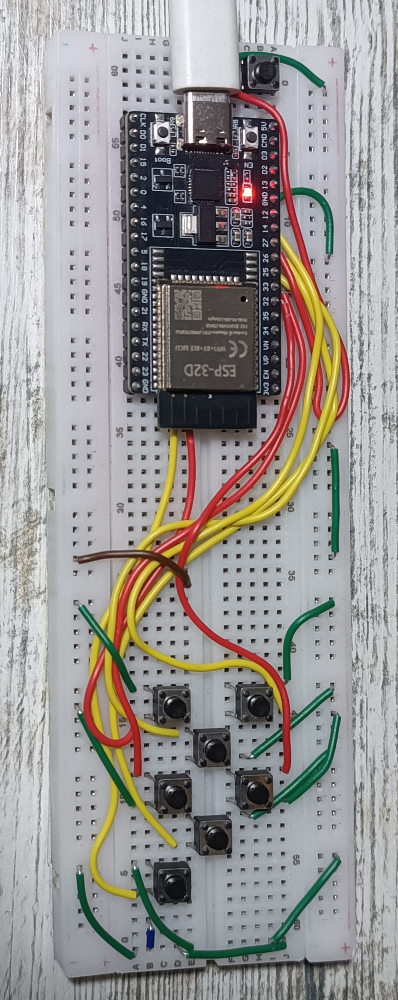

# CYD fan platformer

Old fan build for the ESP32-2432S028 (CYD). Not an official Nintendo game.

Levels load from MARIO.txt on a FAT32 SD card. Controller is ESP-NOW.

## Files

- CYD_Mario_v4_3.ino — game sketch
- MARIO.txt — levels

## Build

Board: ESP32 Dev Module. Library: TFT_eSPI. Partition: Huge APP if the sketch does not fit.

    
    
    
  

#You need to connect a passive buzzer to pin 22 on the CYD

#For the controller (ESP32), wire it according to this scheme:
Connect one leg of each button to the GPIO and the other leg to GND.
#UP → GPIO 32
#DOWN → GPIO 33
#LEFT → GPIO 25
#RIGHT → GPIO 26
#A → GPIO 27
#B → GPIO 14
#START → GPIO 16
#SELECT → GPIO 17
